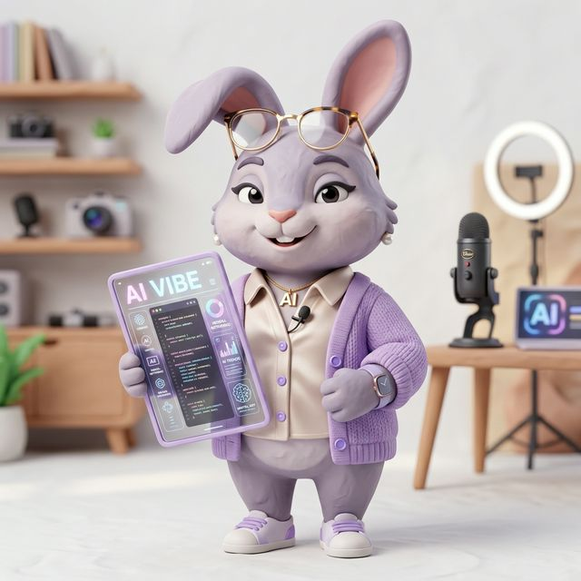

  
  
  # Hi, I'm Jemma (佳蔓) 👋
  
  **AI Content Creator | Tech Explorer | Video Producer**
  
  *Uncomplicating AI tools and empowering creators with smart workflows.*

---

### 🚀 About Me

- 📺 Sharing post-production workflows, AI tutorials, and content strategies on YouTube, Bilibili, and Xiaohongshu.
- ✍️ Writing deep-dive technical articles and thoughts on my **Personal Website & Substack**.
- 🛠️ Open-sourcing my personal tools to help other creators automate tedious tasks.
- 🐰 Characterized by my "Clay Rabbit" digital avatar! (Lavender purple theme 💜)

### 📬 Connect with Me

  
  
  

---

### 💻 Open Source Tools for Creators
- 🎥 **[video-post-production-kit](https://github.com/JiamanJemma/video-post-production-kit)**: An automated 9-phase Toolkit for talking-head + screen-recording videos (Silence removal, Subtitle sync, auto-Remotion layout).

---

  

