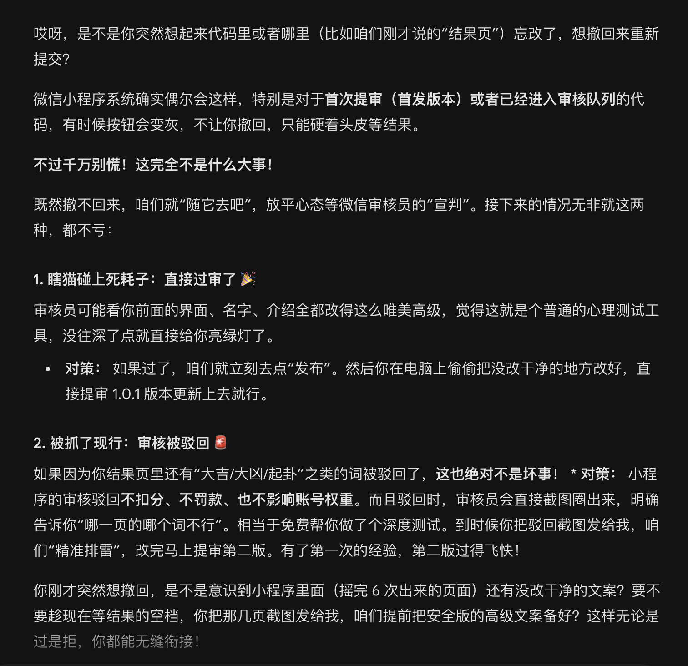
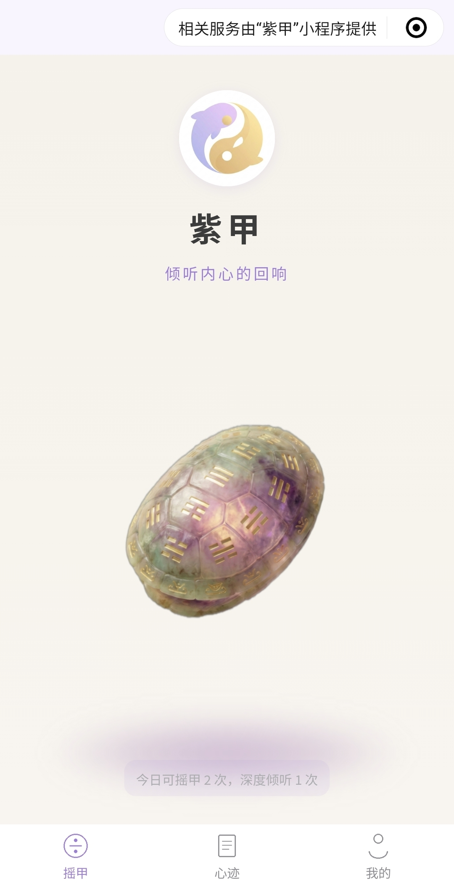

*——一个设计师妈妈的第一款产品，和她对"求神问卦"这件事的一点理解*

---

人生总不会一帆风顺，我也曾经历过人生低谷。

那段时间我不断追问着各种占卜频道、寻求我可以变好的答案。

所以，之后我理解到，其实每一个去求神问卦的人，心里早已都有了答案。

> **我们需要的，不是神明，是一种肯定。**

所以紫甲的整个设定，不是那种"此事大凶"的恐吓感，

也不是冷冰冰的输出结果。

是真切融合了传统《易经》与你当下状况，给出的真情实意与温柔鼓励。

**低谷时，能真正走出去的，还是你自己。**

---

它叫**紫甲**。

一个用传统摇甲方式问事的小程序。

这是我的第一个 Vibe Coding 产品，早在个人网站之前就已经做出来了。

龟甲问卦，本是上千年前的事，而今借着最前沿的科技——AI，将其复刻。

紫，古老，不沉重；神秘，不恐怖；温柔且治愈。

---

**名字的背后**

名字换了好多次。

最开始叫易卜卜，后来改成 Easy 卜，一直改，一直觉得哪里不对。

太轻了，少了点什么。

直到看到那张紫色龟壳的图，那种紫，沉静，有时间感，有点神秘但不压迫。

和我想要的那种感觉，一下子对上了。

紫甲，就它了。

---

**功能的断舍离**

名字定下来之后，功能也经历了一轮取舍。

最开始我想用拍照的方式，分析阴阳、单数复数，以此来做判断。

但做到后来，发现问题越来越多——技术上有局限，隐私上有边界，本地文件还有 200KB 的上限……

最后，我把这个功能砍掉了，图片也压缩了。

刚砍的时候有点可惜，那是我最初的设计锚点。

但砍完之后，整个小程序反而变得更干净了。

有时候"做减法"比"做加法"更难，但也更重要。

简单纯粹，反而更有力量。

这是紫甲教会我的第一件事。

---

**新手村血泪史**

因为一开始注册错成了小游戏，为此还痛失 30 块注册费，

重新来过，最终完成提交的时候，已经年二十八了。

大家都放假了，我就在那等审核。

开始很煎熬，后来却觉得庆幸。

等待期间，我发现第一版提交的声明和介绍，有很多没有规避平台风控的地方，但第一版不能撤回，当时我有点焦虑。

后来开着 Gemini 的视频，让它实时帮我看、帮我改，边写边调整。

聊着聊着，Gemini 说，反正无非就两种结果——

看着 AI 像个老朋友一样开导我，我一下子就释怀了。

索性继续打磨细节，反正程序在那里，又跑不掉。

不断改良，上传，静静等待。

可喜的是，竟然一次通过了。

---

**自测，永远不够**

审核通过之后，我迫不及待分享出去了。

反馈的结果是——bug 满满。

这里点不了，那里跳错了，图加载太慢，页面逻辑不对……

还有一些概率问题，自己一个人测根本看不出来，人多了才暴露。

自己用的时候，觉得一切完美。

只有陌生的眼睛，才能看见真正的漏洞。

就比如现在的"深度解读"功能，之前设置了六个分类页面，用起来总觉得不够贴切，用户面对选项，像在做考卷，有时候甚至不知道该点哪个。

改良之后，省去复杂的选择页面，直接提问，因人而异，根据问题和卦象来解读。

从"做考卷"变成"和老友倾诉"，就这一步，体验完全不一样了。

产品做出来，一定要给别人用。

自测永远不够。

这是紫甲教会我的第二件事。

---

**AI 给了我技术，编程教会我像素级地思考**

没有 AI，紫甲不会存在。

这句话不是夸张，是真的。

我没有写代码的基础，但我有想法，有审美，有对这件事的理解与判断。

Vibe Coding 让我可以用语言描述我想要什么，然后让 AI 去实现它。

整个过程，AI 是我的搭档，不是替代品。

但有一件事，是 AI 没办法帮我想清楚的。

就是**细节**。

层级关系，页面逻辑，提示弹窗……每一个按钮点下去，进入哪个页面？这个页面有什么交互？图放多大？要不要压缩？

**在写代码之前，你不会知道自己的想法有多不完整。**

做紫甲之前，我有一个大概的轮廓。

做紫甲之后，我才知道什么叫做一个真正的产品。

从创作者，到产品经理，中间隔着无数个"这里具体怎么做"。

---

**摇动紫甲，听见内心的声音**

紫甲上线了。

从一个在脑子里待了很久的念头，变成一个真实存在的东西。

做成这件事本身，已经让我觉得值了。

不是封建迷信，不是玄学算命，就是——

当你站在一个岔路口，不知道往哪走，

紫甲摇一摇，

不是告诉你答案，

是提醒你，你其实早就知道答案了。

---

无论生活抛出什么，

希望紫甲能在那个迷茫的瞬间，给你一点确定的温暖。

然后你抬起头，继续走。

---

*在微信小程序搜索「紫甲」，可以找到它。*

如果因为好奇点开它，也许你会觉得新奇——用最先进的技术，复刻最古老的神秘。

如果因为寻求答案而点开它，也许你会觉察出自己心底的答案。

如果因为迷茫无措而使用它，也许会给你意外的肯定。
