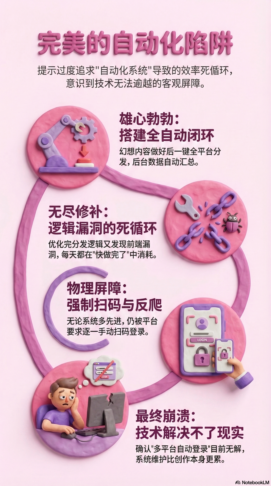
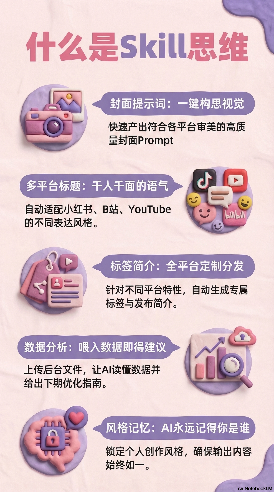
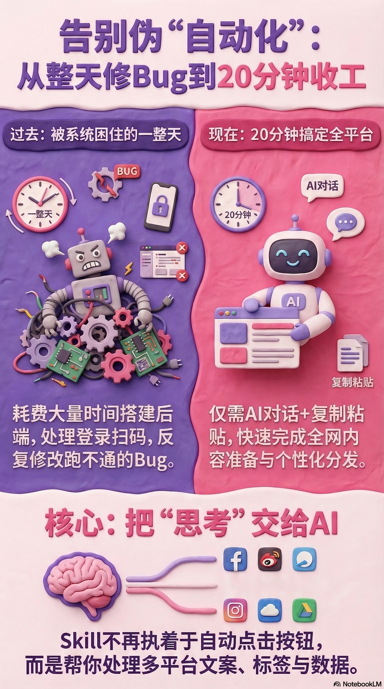

大多数人对"自动化"都有一个误解——
觉得搭好系统，就能一劳永逸。
我也这么想过。
直到我为了一个永远跑不通的流程，扫了不知道多少次码。

---

## 完美的"自动化"陷阱

那几天我一直盯着屏幕，
觉得自己在做一件很重要的事。
自媒体全平台自动分发，听起来就很对——
内容做好，一键发出去，后台数据自动跑，下次优化建议自动给，
整个流程闭环，我只管创作。
很合理。很现代。很"应该这样做"。
于是我就开始搭。

那段时间刚好参加了社群的 mini hackathon，
主题也是自动化。
第一期我分享了自己在做的方向，
感觉还不错，
于是接下来那一周，就给自己压了一口气——
下一次分享，要拿出结果来。

结果就开始绕圈子了。
先是分发逻辑，然后觉得光分发不够，加上后台数据分析，
分析完要看得见，于是做了前端，
前端做着发现后端逻辑有漏洞，回去优化，
优化完又发现……还差一块。
每天都在"快做完了"里循环。

---

## 技术解决不了客观现实

后来有一个下午，我停下来，
觉得光这样做也不是办法，
想着换个方向走一走呢？
我就去测试了一遍全流程。

B 站有 API，但发布列表、分区、简介细节，还是要手动进去填。
YouTube 同理。
国内其他平台更直接——每次都要扫码登录，扫一次，等一次，再扫一次。
本以为是前期阵痛，缕顺就好了，
但发现一直卡在登录这个窗口上，
反而比以前更累，更烦躁。

我问过 AI，说目前没有办法。
但我不信，觉得应该是我没找对方法，还想再试试。

带着这个问题，我去听了一场直播，
专门问了社群里做这块的专业人士——
多平台自动登录这件事，现在能不能解决？
他说，目前无解。
平台的反爬机制越来越严，
这不是技术问题，是客观条件在这里。

说实话，听完有点儿松了一口气。
不是因为问题被解决，
而是因为终于确认了：
这事儿不是我办不到，
是现在本来就没有人能做到。
那口一直压着的气，放下来了。

---

## 从系统思维到 Skill 思维

于是我把那个项目搁下了。
转头就做了 skill。

Skill 轻很多。
不是系统，不是要部署的后端，
就是一套对话逻辑——
告诉 AI：我是谁，我在做什么，我的风格是什么，我需要什么输出。

第一块：封面提示词。
第二块：标题——小红书版、B 站版、YouTube 版，语气各自不同。
第三块：标签、简介、发布时间，各平台错开，不撞车。
第四块：数据分析——我自己去后台下载那份文件，扔进来，AI 帮我读，告诉我下次往哪走。
第五块：风格保持。每一次对话，它都记得我是谁。

为什么这对我来说比自动化更重要？
因为我的时间太有限了。
我分享是想做到 learn in public，展示自我，
可更多的时间浪费在想每个平台那些琐碎的东西上。
Skill 帮我解决的，不是自动帮我点击某个按钮，
而是把"想"这件事交出去了。

做完第一版的那天晚上，
我用了大概二十分钟，
把小红书、视频号、抖音、YouTube、B 站的当周内容全部准备好了。
自己上传，粘贴复制，个性化选一下，
没有扫码，没有等待，没有维护后端。
就是，很快地做完了。

---

后来想想，
我最开始想做自动化的那个初衷——
节省时间、保持风格、每期有数据反馈——
在 skill 里，其实都实现了。
只是方式完全不同，
但它轻得多，也稳得多。

我那套搁置的自动化项目，
现在想想，没有白做。
它让我搞清楚了一件事：
什么是我真正需要的，什么是我以为我需要的。

在个体创作者时代，
也许你不需要一个跑在服务器上的系统，
你需要的是一段对话逻辑——轻的，随时能改的，记得你是谁的。

有时候绕远路不是浪费，
是在用身体丈量那段距离，
然后才知道，
近路在哪里。

