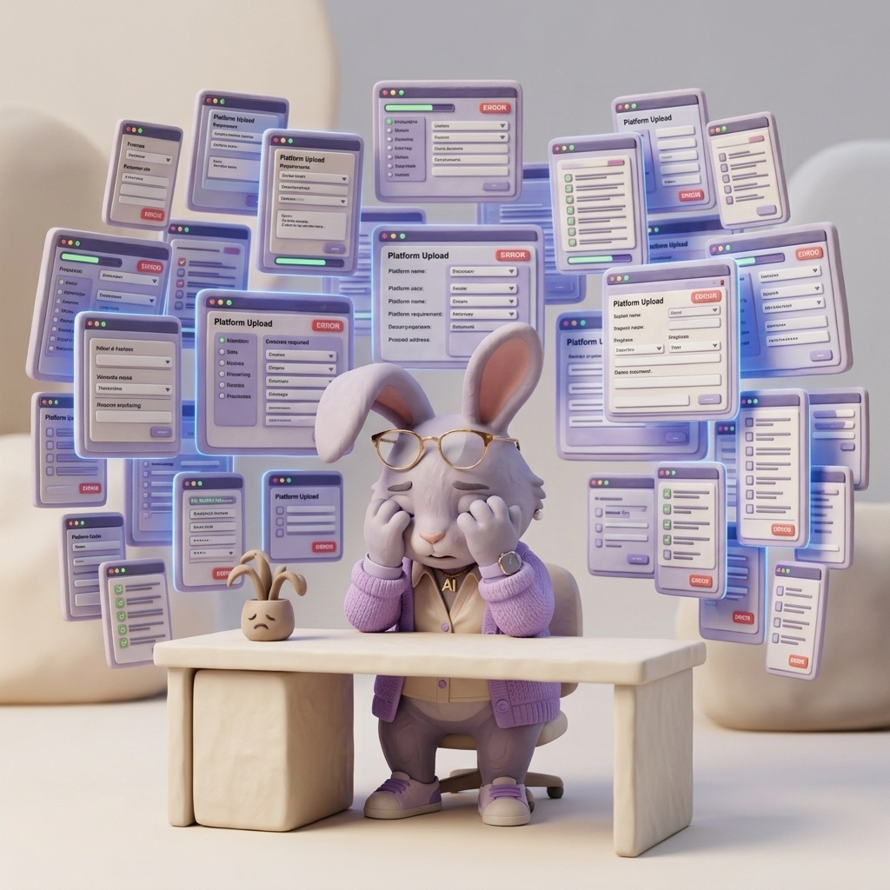
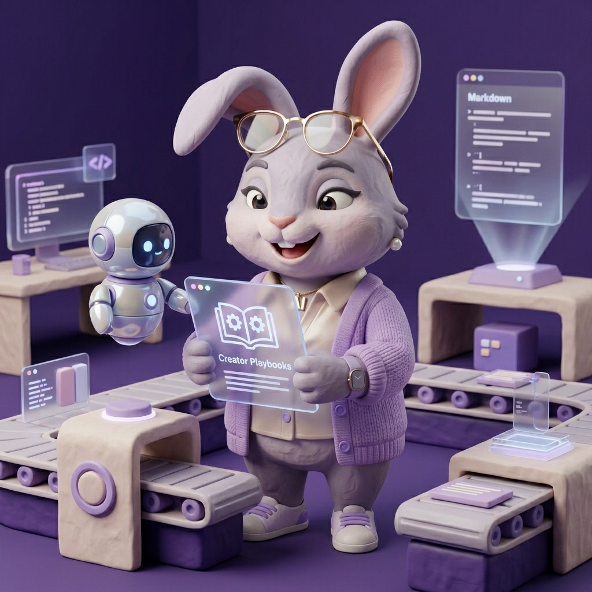
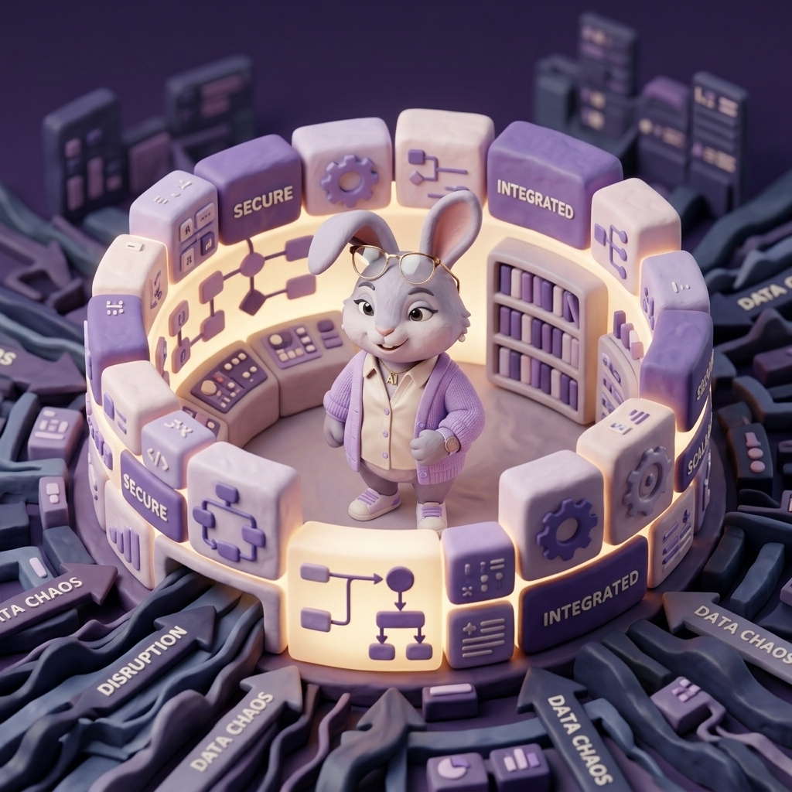
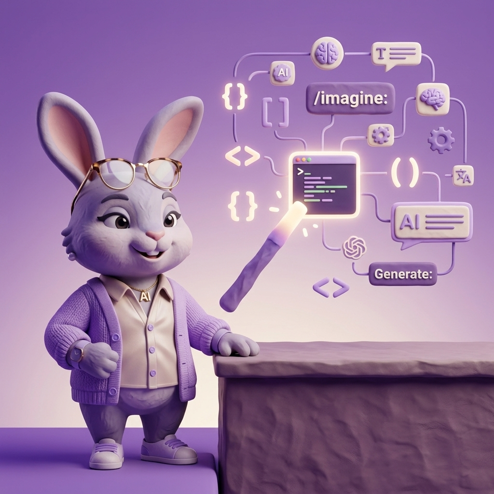

# 🔴 #08 开源我的自媒体管线：用 Prompt 构筑护城河

> **副标题**：别去写代码了。与其把生命消耗在死磕脆弱的爬虫上，不如花一天时间，写一套永远听命于你的自动化指令。
选题、拍摄、剪辑、发布——全是你一个人。
明明做出了很棒的内容，视频终于导出，你刚松了一口气。
但马上，卡在各个平台的分发就让人头疼不已：
你要刻意去记怎么错开各个平台的发布时间，还要应对完全不同的细碎规则。

每个平台的顺序准则都不一样，
B站的标签框必须敲回车键来确认，还不能带 `#` 号。
小红书的标题最多只能写20个字符，
视频号不仅要你在“视频描述”这一个破框里塞进所有东西，还硬要在页面最底端单独塞一行“短标题”。
更可怕的是，如果你因为强迫症，在同一个 Wi-Fi 或设备下把刚出炉的视频同时丢给了国内某音平台和海外的 TikTok —— 恭喜你，双重风控判定启动，明天两边的数据都是个位数的播放。
等等……更别提各个平台还有些细节的选项需要人为去把控。
所以我在想，
这几年科技圈天天在聊赛博空间、AGI、全自动代码。
为什么 2026 年了，我们还在像富士康流水线上的工人一样，每周雷打不动地玩排列组合填表游戏？

---

### 从一个私人的 Skill，到全盘开源的指令集

你们或许还记得，之前我在 `#03《我想做自动化，最后做了一个 skill》` 里写过：为了逃离各平台风控和排版错乱的地狱，我彻底放弃了写自动化 API 通道的念头。
我意识到：**过度追求冷冰冰的“一键全自动”，反而在给自己挖大坑。**我们真正需要的，是一个听得懂人话、有大局观的『大脑』，然后由我们人工来完成最后十秒的复制粘贴。

于是那时候，我给自己捏了一个私人的 AI Skill。
这几周，我每天都在用那个极简的 Skill 处理内容分发。结果我越用越觉得爽。
昨天夜里，当我把上周参加黑客松的复盘视频，丢进这套管线，看着屏幕上自动跑出来一行一扣严格遵守平台规避条件的文案时，我突然冒出一个念头：

**既然“打地鼠”的搬砖痛点所有创作者都有，我为什么不把我调教这个 Skill 的底层核心文件，直接开源出来呢？**
大家只需要照抄我的配置参数，就能直接让你们手里的 AI 变成一样聪明的超级外脑。

这套体系其实我酝酿、打磨了蛮久。最初我是想把从“视频自动化处理”到“全网分发”的整座巨型冰山一次性抛出来。
但后来我发现，底层互相引用的 `.md` 配置文件实在太多了。如果一口气端出来，大家根本无从下手。
**所以整理之后，我决定分批开源。**
让大家可以像搭积木一样，根据自己的需要，**分阶段**把这些“外脑组件”引入到你们自己的工作流里。

今天作为第一批，我们先开源整个管线里最立竿见影的“发稿、排版与日常中枢”部分。
我把这些私人的配置文件重构成了一套可以在大模型外挂的轻量化 Markdown 文件夹。
我把它命名为 `Creator-Playbooks`。
然后，我在这套开源指令里，写死了几条大家都能直接抄去用的铁律：

**第一条：防呆视觉映射。**
我明确告诉系统，以后但凡生成 B站 或 视频号 的发布配置，绝对禁止把发布时间写在最顶上。
必须老老实实地严格按照**【页面填表物理顺序】**去排版。标题 -> 空行 -> 标签无井号 -> 长正文 -> 最尾端打上定时发布时间。
这样，我在分发时视线直接从电脑屏幕顶端滑到低端，不需要二次大脑介入。

**第二条：物理隔离防封杀。**
我写死了一条 48 小时海外错峰规则：
只要当前流水线生成的任务涵盖了国内首发，TikTok 的发布时间就会被我的底层规则强行改写到**次日早晨 08:30**。
这不仅仅是为了物理隔离设备的防欺诈算法，更是因为次日早上八点半，正好卡死了北美受众的通勤黄金期。

**第三条：侵入物理世界的原生闹钟。**
X（Twitter）和 Instagram 其实不支持在移动端完美地搞自动定时发布。以前我只能记在备忘录里干等。
现在，如果系统感知到了这两个平台的任务，它会通过一层底层的 AppleScript 代码调用。
在生成文案的瞬间，我的 Mac 和 iPhone 就会同时“叮”一声。
一个原生的 Apple 提醒事项已经建好了，就在明天早上等待我划开锁屏。

---

### 系统，才是真正的护城河

它不是什么高精尖的模型微调。
它只是通过结构化的逻辑设定，把人的情绪劳动，转嫁给了极其听话的硅基生命。

其实我原本就打算开源自己的发布系统软件。
但我转念一想，如果换一种更轻量的、“零代码”的分享方式，把所有的知识压缩在这几个薄薄的文本里，是不是能让更多完全不懂技术的创作者直接受益？
所以，我就这么做了。
每多一个用这套系统武装自己的创作者，平台那些繁杂无聊的规则，就少一分困住我们的力量。

所以我把它推到了我的 GitHub。
我叫它 `Creator-Playbooks`。
你不需要会写代码，你甚至不需要懂任何高深的技术。你只要把它 Fork 回去，把里面带有 `#佳蔓Jemma` 的标签换成你自己的名字，把你自己的黄金转化时间填入那张 Markdown 检索表里。
剩下的，全丢给你的 AI。

在这个 90% 的内容一秒钟内就能被代码完美复刻的时代。
代码早就不是护城河了。
**你如何构建属于自己的那套运转系统，你如何占据和分配自己的创造力带宽，这才是那唯一的 5%。**

把最宝贵的时间和精力，留给真实的创作吧。

🔗 **GitHub 开源库：[JiamanJemma/Creator-Playbooks](https://github.com/JiamanJemma/Creator-Playbooks)**

---

**🐰 关于我 & 更多连接**
这是佳蔓 Jemma，和你一起探索 AI 时代的创作者杠杆。如果你觉得我的分享有价值：
- 💌 **免费订阅 Newsletter**：[jemma747318.substack.com](https://jemma747318.substack.com) (每周同步我的实操复盘)
- 📺 **看带壳原声视频请来 YouTube**：[搜索「佳蔓 Jemma」]
- 🌎 **所有干货汇总网站**：[jiamanjemma.com](https://jiamanjemma.com)
- 💻 **开源代码库**：[GitHub @JiamanJemma](https://github.com/JiamanJemma)

> **【公众号封面】**

