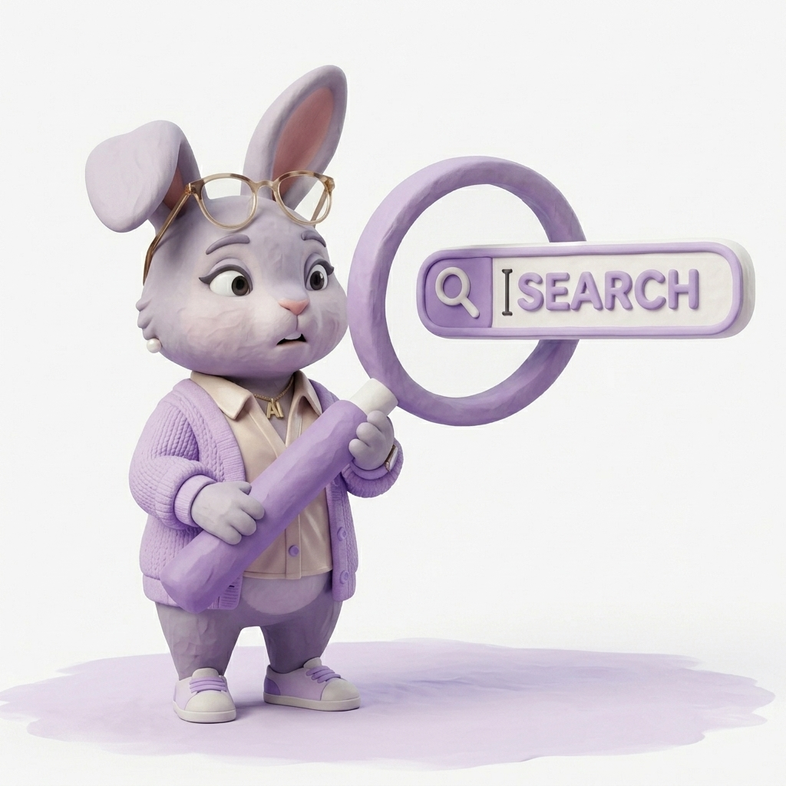

# #09 问对问题：你不需要学会提问

前段时间，两个表姐轮流来家里做客。

我抱着玩一玩的心态，说用 DeepSeek 帮她们批八字。

结果卡在了第一步。

该给什么信息？
想问什么方向？
想要一个什么样的结果？

她们都不知道。

大表姐盯着输入框想了一会儿，打了几个字，又删掉了。

不是不感兴趣。
是真的不知道从哪里开口。

---

## 大多数人把 AI 当高级百度在用

这样用没什么问题。
查地址、翻译、找攻略，够了。

但有些问题，用搜索引擎的逻辑问不出来。

"我最近很焦虑，不知道从哪里使劲。"
"想跟孩子好好聊，但每次都变成吵架。"
"想换工作，但说不清楚自己想要什么。"

这种问题打进百度，它给你一个文章列表。
打进 AI，它给你的，也差不多。

因为你给它的，还是一个搜索词。

比如你说"我最近很焦虑"。
AI 给你的，可能是五条正确但没用的建议：
多运动、保持睡眠规律、减少负面信息摄入……
都对。但也都没用。

---

## 卡住的地方，其实不是"不会用 AI"

我的视频后台经常收到这类留言："我想学 AI，但不知道怎么开始。"

其实大多数人被卡住的地方，不是工具不会用，也不是提示词没学好。

瓶颈出在更前面
不知道自己真正想问什么。

"我想做个 APP，但我完全不懂代码怎么办？"

和

"我想做一款能自动整理笔记的效率 APP。
完全没有技术背景。
不知道现在的 AI 能不能直接帮我把它做出来。
在不从头学编程语言的前提下，我今晚能尝试的最小验证步骤是什么？"

这两个问题，得到的是完全不同的回答。

但第一种，才是大多数人的本能反应。

---

## 那为什么不教大家学提问呢

我也想过。

但很多人问不出好问题，不是因为懒。
是因为对这个领域一无所知。

面对完全陌生的领域，普通人的第一直觉都是模糊的。
以前可能还需要去苦学 Prompt 规则来梳理问题，但随着 AI 的不断进化，目前大模型的水平，已经完全足够在“懂你”之后，反向为你生成一份顶级的提问词。

我们要做的，不是绞尽脑汁去凑齐条件。
而是利用 AI 远超人类的知识广度，让它来主导对话。
让它把你模糊的想法拼凑成结构，挖出你深层的需求。
**在这套机制里，AI 负责梳理边界，你只负责做决定（Yes 或 No）。**

当你还没有足够信息的时候，偏偏要求你先在脑子里组织好一个完美问题

这完全本末倒置了。

就像你去医院，医生不会说
"你先回去想清楚哪里不舒服，想好了再来"。

你只需要说"我不舒服"。
问出你哪里疼，是医生的事。

我当时就在想：
这种"追问"的能力，能不能固化成一个工具？

---

## 所以我做了一个「帮你提问」的 Skill

叫 ask-right。
（我已经把这套提示词框架完全开源在 GitHub，可以直接抓去用：[ask-right-skill](https://github.com/JiamanJemma/ask-right-skill)）

它不等你先想好。
它先来问你。

你说"我想做个 APP"。
它就来问：想做什么类型的？给谁用？有没有技术背景？

两三个问题之后，它帮你把模糊的想法重新组织成一个 AI 能真正接住的问题。
直接给你答案，或者把优化好的问法复制给你，拿去任何 AI 里用。

---

还是那个想做 APP 的例子。

**你原来的问法：**
"我想做个 APP，但我完全不懂代码怎么办？"

**ask-right 问了你几个问题，重组后：**
"我想做一款能自动整理笔记的效率 APP。
完全没有技术背景，甚至连代码长什么样都看不懂。
不知道能否用 AI 直接帮我写出这款应用？
请帮我分析：在不从头学编程的前提下，我今晚能尝试的最小验证步骤是什么？给具体的步骤建议。"

同一件事，完全不同的问法。

---

它不是教你 prompt 技巧。
那条路门槛太高，方向也不对。

真正有价值的是你的想法。
只要你有哪怕一丝想法，当下就能去试。
不需要先囤技能，不需要先搞懂提示词大全，再进行下一步。

你只需要抛出一个最原始的想法或困惑。
怎么问，交给它来。
